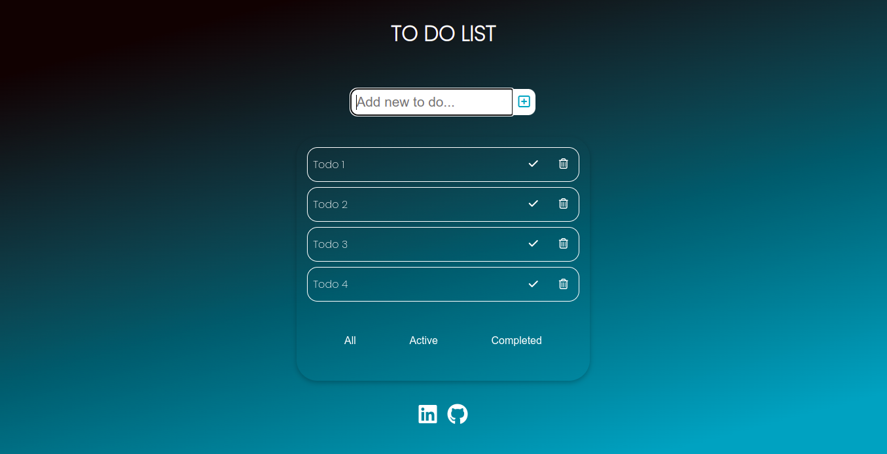

# To Do App

## Table of contents

- [To Do App](#to-do-app)
  - [Table of contents](#table-of-contents)
  - [General info](#general-info)
    - [Objectives](#objectives)
    - [Screenshot](#screenshot)
    - [Links](#links)
    - [Technologies](#technologies)
  - [Author](#author)

## General info

### Objectives

This app was created for the user to be able to:

- Add new todos to the list
- Mark todos as complete
- Filter todos by status: All/Active/Completed
- Delete todos from the list

### Screenshot

### Links

- Deploy: [To Do App](https://palucas-todo-list.vercel.app/)

### Technologies

- HTML
- CSS
- React.js

## Author

- [Lucas Pontes Arruda](https://www.linkedin.com/in/lucas-pontes-arruda/)
